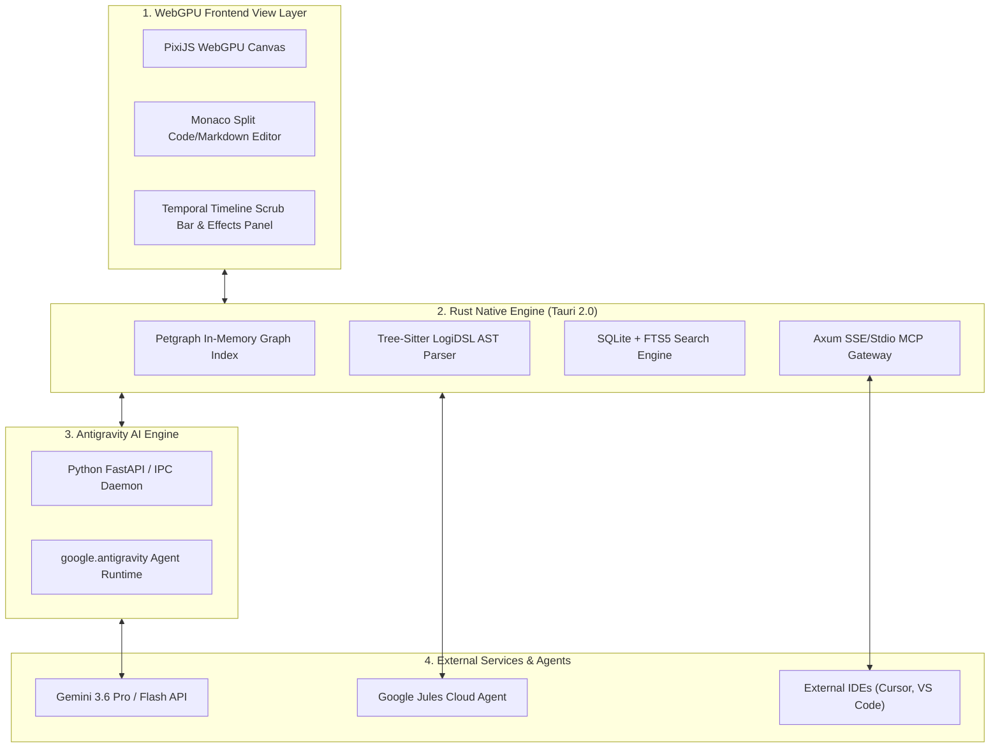

# 🎈🎈 twoballoons

> **Local-first visual diagramming & logic engine powered by a diagram-agnostic syntax (`LogiDSL`), Tauri 2.0, WebGPU, Antigravity AI sidecar, temporal keyframing ($2\text{D} + T$), and Google Jules MCP integration.**

---

## 📌 Executive Summary

**twoballoons** synthesizes the best aspects of personal knowledge management (**Obsidian**), hierarchical software architecture modeling (**IcePanel**), spatial generative AI diagramming (**DiagramGPT**), and timeline motion controls into a unified native desktop environment.

At its core, **twoballoons** introduces **`LogiDSL`**—a diagram-agnostic logical syntax that acts as an intermediate representation (IR) between human thought, formal logic, and visual diagram targets. A single `.logi` file can be projected dynamically into PlantUML, Mermaid.js, Graphviz/DOT, D2, and LaTeX/TikZ.

---

## ✨ Core Pillars

1. **📄 Nodes as Deep Documents**: Every canvas shape doubles as a full Markdown document with WikiLinks (`[[Page]]`), block references, YAML frontmatter, and embedded code blocks.
2. **🏗️ Hierarchical C4 Modeling**: Single source of truth object-oriented catalog. Drill down seamlessly from Level 1 (System Context) to Level 2 (Containers) to Level 3 (Components).
3. **⏳ Temporal 3D Graph ($2\text{D} + T$)**: Video-editing style timeline scrubber with diamond keyframes and a left Effects Panel for animated particle flows, velocity curves, and architecture evolution over time.
4. **🧮 Diagram-Agnostic Logical Syntax (`LogiDSL`)**: Intermediate Representation (IR) unifying informal argument mapping (Premise $\rightarrow$ Conclusion) with formal logic circuits (AND, OR, NOT, Predicates).
5. **🎨 Spatial AI & Context-Aware Engine**: Bounding-box drag selection triggers targeted AST updates via an embedded **Antigravity AI Sidecar** with real-time reasoning thought streams (`response.thoughts`).
6. **🔌 Google Jules & IDE MCP Integration**: Bi-directional Model Context Protocol server/client allowing Google Jules cloud agents and IDEs to query system architecture via `twoballoons://` URIs and log Architecture Decision Records (ADRs).
7. **🛠️ Adobe-Style Modular Workspace**: Dockable tabbed panel system (FlexLayout / GoldenLayout), far-left vertical toolstrip (`V`, `M`, `C`, `L`, `T`, `W`, `Z`), top option bar, and bottom console drawer.
8. **⚡ High-Performance Native Core**: Built with Tauri 2.0, Rust (`petgraph` + `tree-sitter`), SQLite + FTS5 full-text search, and WebGPU canvas rendering at 60+ FPS.

---

## 📚 Architectural Documentation Sitemap

Explore our detailed design specifications in the [`docs/`](docs/) directory:

* 🔗 [**Master System Integration Specs** (`docs/SYSTEM_INTEGRATION_SPEC.md`)](docs/SYSTEM_INTEGRATION_SPEC.md): Comprehensive linkage diagrams, data plumbing sequences, AST compilation pipelines, and state machines across all software components.
* 📐 [**System Architecture Specs** (`docs/ARCHITECTURE.md`)](docs/ARCHITECTURE.md): Layer-by-layer technical breakdown of Tauri 2.0 Rust engine, WebGPU UI, SQLite database choice, and IPC.
* ⏳ [**Temporal Graph & Timeline Specs** (`docs/TIMELINE_AND_WORKSPACES_SPEC.md`)](docs/TIMELINE_AND_WORKSPACES_SPEC.md): Deep-dive specification for $2\text{D}+T$ time scrubbing, node keyframing, packet flow velocity curves, and context-aware AI.
* 🧮 [**Diagram-Agnostic Logical Syntax** (`docs/LOGIDSL_SPEC.md`)](docs/LOGIDSL_SPEC.md): Full `LogiDSL` grammar, operator taxonomy, AST structs, and transpilation emitters for PlantUML, Mermaid, DOT, D2, and LaTeX.
* 🤖 [**Google Jules & MCP Gateway** (`docs/JULES_MCP_SPEC.md`)](docs/JULES_MCP_SPEC.md): Embedded Axum SSE/Stdio MCP server spec, resource endpoints, tool definitions, visual patch previewer, and ADR logging.
* 🧠 [**Antigravity Generative AI Engine** (`docs/ANTIGRAVITY_GENAI.md`)](docs/ANTIGRAVITY_GENAI.md): Python sidecar architecture using `google-antigravity`, real-time reasoning streams (`response.thoughts`), and sandboxed execution.
* 🎨 [**Adobe-Style UI Design Guide** (`docs/DESIGN.md`)](docs/DESIGN.md): UI design tokens, Google Stitch copy-paste prompt blocks, component wireframes, and Adobe-style toolbar specs.

---

## 🗺️ Master System Linkage Topology

---

## 🖼️ Workspace Mockup Previews

### 1. Temporal 3D Graph & Timeline Keyframe Workspace

### 2. Adobe-Style Modular Tabbed Workspace

---

## 📄 License

MIT © twoballoons contributors.
