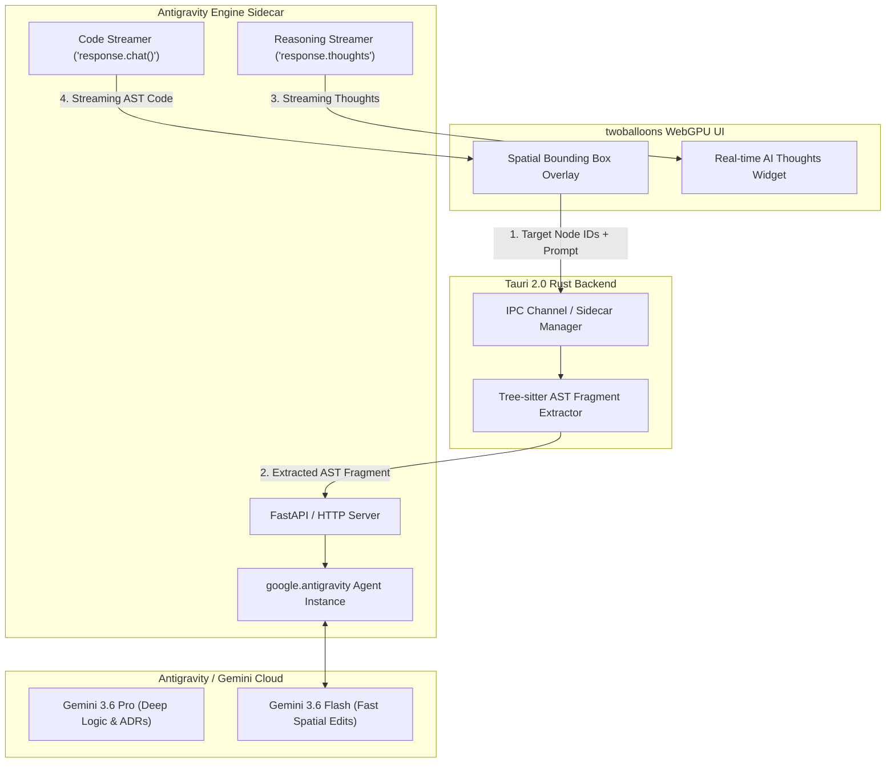

# 🧠 Antigravity Generative AI Engine Integration Specification

## 1. Architecture Overview

**twoballoons** uses the **Antigravity Python SDK (`google-antigravity`)** as its primary generative AI engine. The engine runs as an isolated Python daemon process managed by the Tauri 2.0 Rust backend.

It provides three core capabilities:
1. **Spatial "Generative Fill"**: Modifies specific bounding-box sub-regions of a diagram without mutating unselected nodes.
2. **Real-time Reasoning Streams (`response.thoughts`)**: Streams the AI's internal reasoning deltas directly into the UI.
3. **Sandboxed Code & AST Parsing**: Runs with project-level capability grants (`CapabilitiesConfig`).



---

## 2. Python Sidecar Implementation (`sidecar/antigravity_daemon.py`)

```python
import asyncio
import json
import sys
from fastapi import FastAPI
from fastapi.responses import StreamingResponse
from google.antigravity import Agent, LocalAgentConfig, CapabilitiesConfig

app = FastAPI()

SYSTEM_INSTRUCTIONS = """
You are the generative AI engine for twoballoons.
You edit diagram AST fragments in LogiDSL, Mermaid, and PlantUML.
When given a spatial sub-region, modify ONLY the targeted node IDs provided.
Preserve all unselected node layout coordinates and connection anchors.
"""

@app.post("/generate/spatial-fill")
async def spatial_generative_fill(payload: dict):
    target_ast = payload.get("target_ast")
    user_prompt = payload.get("prompt")
    model_choice = payload.get("model", "gemini-3.6-flash")

    config = LocalAgentConfig(
        system_instructions=SYSTEM_INSTRUCTIONS,
        capabilities=CapabilitiesConfig(read_only=True)  # Sandboxed execution
    )

    async def event_generator():
        async with Agent(config) as agent:
            prompt = f"TARGET AST FRAGMENT:\n{target_ast}\n\nUSER INSTRUCTION:\n{user_prompt}"
            response = await agent.chat(prompt)

            # 1. Stream reasoning/thinking deltas to UI
            async for thought in response.thoughts:
                yield f"data: {json.dumps({'type': 'thought', 'content': thought})}\n\n"

            # 2. Stream generated AST code tokens
            async for token in response:
                yield f"data: {json.dumps({'type': 'token', 'content': token})}\n\n"

    return StreamingResponse(event_generator(), media_type="text/event-stream")
```

---

## 3. Feature Mapping Matrix

| Feature | Antigravity SDK API | Purpose |
| :--- | :--- | :--- |
| **Spatial Fill** | `agent.chat(prompt)` | Targeted AST fragment rewriting. |
| **Thinking Stream** | `async for thought in response.thoughts` | Renders real-time AI reasoning in UI. |
| **Token Stream** | `async for token in response` | Real-time code compilation on canvas. |
| **Tool Interception** | `async for call in response.tool_calls` | Validates `LogiDSL` syntax before emitting. |
| **Sandboxing** | `CapabilitiesConfig(read_only=True)` | Prevents unauthorized file writes. |
