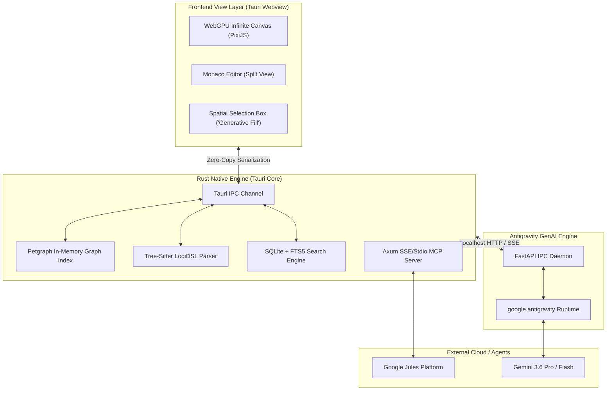

# 🏗️ twoballoons System Architecture Specification

## 1. Executive Architecture Overview

**twoballoons** is engineered as a local-first, privacy-preserving, high-performance desktop application built on **Tauri 2.0**, **Rust**, **WebGPU**, **SQLite**, **`google-antigravity`**, and the **Model Context Protocol (MCP)**.

The system decouples state into four distinct performance zones:
1. **Graphics Zone (Frontend)**: Renders infinite canvases, node vectors, and spatial overlays via WebGPU/PixiJS at 60+ FPS.
2. **Compute Zone (Rust Backend)**: Maintains in-memory graph topologies via `petgraph` and parses syntax incrementally via `tree-sitter`.
3. **Persistence Zone (Local Disk)**: Stores user content in open, human-readable `.md` and `.canvas` files, indexed by a local SQLite + FTS5 database.
4. **AI & Integration Zone (Sidecars & Gateway)**: Runs an Antigravity Python sidecar for generative AI tasks and an Axum SSE MCP server for external agent integration (Google Jules).



---

## 2. Core Technical Layer Breakdown

### Layer 1: Desktop Shell & Concurrency (Tauri 2.0 + Rust)
* **Tauri 2.0 Shell**: Provides cross-platform desktop execution (Windows, macOS, Linux) with a minimal RAM footprint compared to Electron.
* **`petgraph` In-Memory Index**: Houses directional link networks in RAM. Allows $O(1)$ graph traversal for backlinks, local graph neighborhood physics, and C4 depth-level drill-down resolution.
* **`tree-sitter` Incremental Parser**: Parses embedded `LogiDSL`, Mermaid, and PlantUML blocks incrementally as the user types, highlighting syntax errors without blocking execution.
* **`tokio` Multi-threading**: Isolates file watching, database IO, sidecar management, and MCP Server routing across separate thread pools.

---

### Layer 2: Persistence & Storage Strategy (SQLite vs. DuckDB)

```
Notebook Vault Directory/
├── .twoballoons/
│   └── index.db           # Local SQLite Database (Petgraph cache + FTS5)
├── pages/                 # Markdown pages attached to canvas nodes
│   ├── auth_service.md
│   └── database_spec.md
├── diagrams/              # LogiDSL source files (.logi)
└── canvas/                # Visual layout JSON files (.canvas)
```

#### Why SQLite over DuckDB for twoballoons
While DuckDB is exceptional for OLAP (analytical columnar queries across millions of rows), **twoballoons** is fundamentally an **OLTP (Transactional)** desktop application:
1. **High-Frequency Point Writes**: Users dragging canvas nodes, typing text paragraphs, and auto-saving require thousands of tiny, sub-millisecond writes. SQLite row storage excels at point writes; DuckDB columnar storage locks under rapid point updates.
2. **Full-Text Search (FTS5)**: SQLite includes built-in trigram FTS5 for document indexing with BM25 relevance ranking.
3. **Low Memory Footprint**: `rusqlite` adds ~1.5 MB to the compiled Rust binary.

---

### Layer 3: Graphics & Interaction (WebGPU + PixiJS)
* **WebGPU Canvas Renderer**: Renders 10,000+ nodes, dynamic vectors, and curved connector lines at 60 FPS without DOM slowdowns.
* **Spatial Drag-Select Overlay**: Users drag-select a bounding box over a subset of canvas nodes. The bounding box extracts target node IDs and passes only their underlying AST fragment to the Antigravity engine for localized AI rewriting ("Generative Fill").

---

### Layer 4: Generative AI Engine (Antigravity Python Sidecar)
* **Architecture**: A Python process wrapping `google.antigravity` runs on a local port.
* **Streaming Thoughts**: Exposes `async for thought in response.thoughts`, rendering real-time AI reasoning deltas in a collapsible UI widget.
* **Sandboxed Tool Executions**: Uses `CapabilitiesConfig` to restrict agent file system access and enforce read-only execution modes when analyzing code.

---

### Layer 5: External Agent Gateway (Google Jules MCP)
* **Embedded Axum SSE Server**: Serves standard Model Context Protocol (MCP) endpoints on `localhost:8080/mcp/sse`.
* **Resource Provider**: Exposes system architecture context via `twoballoons://vault/architecture/c4` and `twoballoons://vault/pages/{id}` URIs.
* **Visual Patch Inspector & ADR Logger**: Intercepts patches from Google Jules (`jules_get_patch`), displays visual previews over C4 nodes, and logs an Architecture Decision Record (ADR) upon approval.
