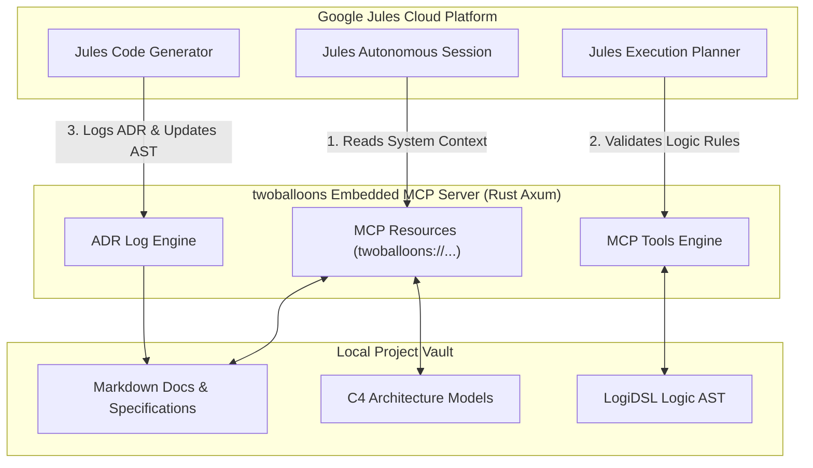

# 🤖 Google Jules & Model Context Protocol (MCP) Gateway Specification

## 1. Architecture Overview

**twoballoons** embeds an async Model Context Protocol (MCP) server directly inside its Rust backend (`axum` framework running on `localhost:8080/mcp/sse`).

This server allows **Google Jules** (Google's autonomous cloud coding agent) and external IDEs (Cursor, VS Code, Claude Desktop) to query system architecture specs, read Markdown documents, validate logic rules, and log Architecture Decision Records (ADRs) bi-directionally.



---

## 2. Exposed MCP Resources

Google Jules agents can query these `twoballoons://` URIs to retrieve project context before generating code:

| Resource URI | Format | Description |
| :--- | :--- | :--- |
| `twoballoons://vault/architecture/c4` | JSON / Markdown | Returns the full C4 System Context, Container, and Component hierarchy. |
| `twoballoons://vault/pages/{page_id}` | Raw Markdown | Returns specific deep Markdown pages, requirement docs, or ADRs. |
| `twoballoons://vault/logic/ast` | JSON AST | Returns the formal and informal `LogiDSL` logic AST. |
| `twoballoons://vault/diagrams/{id}` | DSL Code | Returns target PlantUML / Mermaid / D2 diagram source code. |

---

## 3. Exposed MCP Tools

Google Jules agents can invoke these tools during execution:

### 1. `twoballoons_query_architecture`
* **Input**: `{ "component_name": "IngressGateway" }`
* **Output**: Returns technological stack, API endpoints, security bounds, and dependencies for `IngressGateway`.

### 2. `twoballoons_validate_logic_constraints`
* **Input**: `{ "proposed_interface": "fn login(user: String) -> Result<JWT, AuthError>" }`
* **Output**: Validates proposed code against `LogiDSL` assertion rules (e.g. checks if preconditions and postconditions match `auth_system.logi`).

### 3. `twoballoons_update_diagram_ast`
* **Input**: `{ "diagram_id": "auth_system", "dsl_diff": "+ component RateLimiter ..." }`
* **Output**: Appends new nodes or edges directly to `twoballoons`'s visual canvas code block.

### 4. `twoballoons_create_adr`
* **Input**: `{ "title": "Adopt Keycloak for Identity", "status": "accepted", "context": "..." }`
* **Output**: Logs an **Architecture Decision Record (ADR)** directly into the local project vault.

---

## 4. Visual Patch & ADR Workflow (Jules $\rightarrow$ twoballoons)

```mermaid
sequenceDiagram
    autonumber
    actor User
    participant Canvas as twoballoons Canvas
    participant Rust as Rust Engine
    participant Jules as Google Jules API

    User->>Canvas: Right-clicks node -> 'Launch Jules Session'
    Canvas->>Rust: Bundle C4 context + node specs
    Rust->>Jules: jules_create_session(prompt + bundled_context)
    
    loop Session Execution
        Jules-->>Rust: Agent updates progress & execution plan
        Rust-->>Canvas: Overlay plan steps over C4 nodes
    end

    Jules->>Rust: Emit completed code patch (jules_get_patch)
    Rust->>Canvas: Display visual diff preview over affected C4 components
    User->>Canvas: Clicks 'Approve & Merge'
    Canvas->>Rust: Execute git merge & invoke twoballoons_create_adr
    Rust->>Jules: jules_approve_plan / complete session

---

## 5. Local Antigravity Agent Skill Integration (`jules-prompting-engineering`)

> [!NOTE]
> The prompt structure and 20-step plan heuristics below are configured inside the local **Antigravity AI Agent Skill** ([`C:\Users\hatir\.gemini\config\skills\jules-prompting-engineering\SKILL.md`](file:///C:/Users/hatir/.gemini/config/skills/jules-prompting-engineering/SKILL.md)) and [`AGENTS.md`](file:///F:/Documents/Zim/.agents/AGENTS.md). They govern how Antigravity creates and dispatches autonomous coding tasks to Google Jules during development of `twoballoons`.

When Antigravity dispatches autonomous coding tasks to Google Jules (via `jules_create_session` or `jules_send_message`), it formats the prompt using the user's master prompt template:

```text
Do a systematic review of product documentation in the repository. There is a sample UI in there, use it as a general guidepost for when you implement UI for the application. I would like the first prototype of the application to be production ready, your job is to get as much code down as possible to create this first version.

Minimum of 20 steps in your plan when you use the plan tool. Focus on meeting the intent of product specs and doing extensive testing to ensure the application is robust and well designed. 

Heuristic guidance:
1. If you are unsure whether to add a feature, add it.
2. If you are unsure how to implement something, review documentation and pick the most robust and bulletproof implementation you can think of. I prefer more code being written to do something right, than less code and it being done wrong.
3. Focus on intention and not the strict language of the specs. Use search to find the most cutting edge methods for any particular implementation. Always check which version of software is most recent, you have old training data and I want this to be cutting edge.

[Specific Task / Target Feature Details Here]
```

### Local Skill Heuristics
1. **Minimum 20-Step Execution Plans**: Mandatory 20-step plan across Audit, Core Plumbing, Implementation, Containerization, and E2E Verification.
2. **Zero-Placeholder Policy**: Production-ready code without empty handlers or `// TODO` stubs.
3. **Intent-Driven Engineering**: Focus on software intent using modern libraries and up-to-date dependencies.

