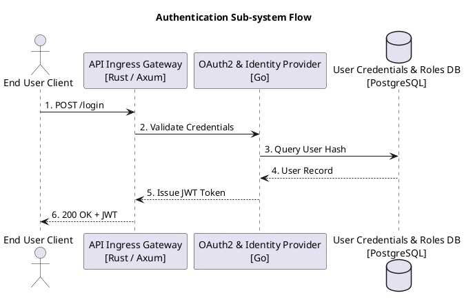
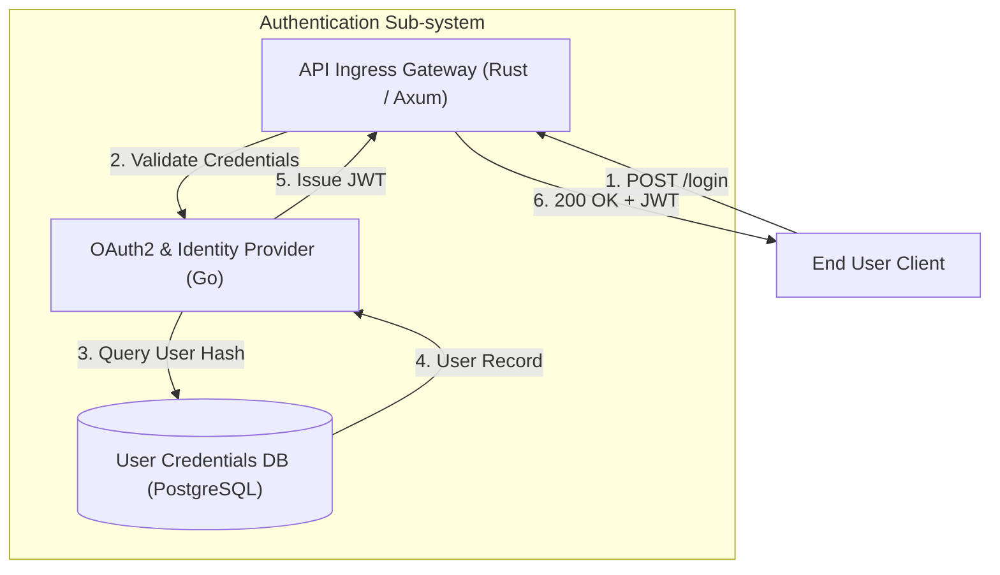
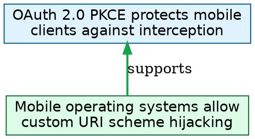

# 🧮 Diagram-Agnostic Logical Syntax Specification (`LogiDSL`)

## 1. Rationale & Philosophy

Most diagramming tools force developers to choose between visual design tools (Lucidchart, IcePanel) and code-based diagram syntax (PlantUML, Mermaid.js). However, code-based tools are typically tied to a single diagram type (e.g. sequence diagrams vs flowcharts vs C4 maps).

**`LogiDSL`** solves this by acting as an **Intermediate Representation (IR)**—the "LLVM of Diagrams". In `LogiDSL`, you model system entities, relationships, formal logic assertions, and informal argument claims. You then apply declarative `@view` projections to output PlantUML, Mermaid.js, Graphviz/DOT, D2, or LaTeX/TikZ automatically.

> **Note**: For complete mathematical semantics, multi-modal Kripke frames, justification evidence algebras, and dynamic epistemic model updates, see the full [**PhiloDSL ($\mathcal{L}_{\text{diag}}$) v2.0.0 Specification**](PHILODSL_SPEC_V2.md).


---

## 2. LogiDSL Grammar & Primitives

```logi
// ==========================================
// 1. ENTITIES (Nodes & Structural Objects)
// ==========================================
actor User {
    label: "End User Client"
    icon: "user"
}

component IngressGateway {
    label: "API Ingress Gateway"
    kind: "container"
    tech: "Rust / Axum"
}

component IdentityService {
    label: "OAuth2 & Identity Provider"
    kind: "service"
    tech: "Go"
}

store AccountDB {
    label: "User Credentials & Roles DB"
    kind: "database"
    tech: "PostgreSQL"
}

// Informal Argumentation Claims
claim Claim_PKCE {
    label: "OAuth 2.0 PKCE protects mobile clients against auth code interception"
    status: "accepted"
}

claim Premise_MobileSecurity {
    label: "Mobile operating systems allow custom URI scheme hijacking"
}

// Formal Logic Gates
gate TokenValid = AND(AccountDB.UserExists, IngressGateway.HeaderValid)

// ==========================================
// 2. RELATIONS & INFERENCES
// ==========================================

// Operational Flow (Sequence & Flowcharts)
User -> IngressGateway : "1. POST /login"
IngressGateway -> IdentityService : "2. Validate Credentials"
IdentityService -> AccountDB : "3. Query User Hash"
AccountDB -> IdentityService : "4. User Record"
IdentityService -> IngressGateway : "5. Issue JWT Token"
IngressGateway -> User : "6. 200 OK + JWT"

// Informal Logic Inference (Argument Mapping)
Premise_MobileSecurity => Claim_PKCE : "supports"

// Structural Boundaries (C4 Model Containers)
boundary AuthSystem {
    label: "Authentication Sub-system"
    contains: [IngressGateway, IdentityService, AccountDB]
}

// ==========================================
// 3. FORMAL LOGIC ASSERTIONS
// ==========================================
assert TokenValid => System.AccessGranted
assert NOT(AccountDB.UserExists) => System.AccessDenied

// ==========================================
// 4. PROJECTIONS (@view Rules)
// ==========================================
@view sequence_flow {
    type: "sequence"
    participants: [User, IngressGateway, IdentityService, AccountDB]
}

@view architecture_c4 {
    type: "c4_container"
    focus: AuthSystem
}

@view argument_map {
    type: "argument"
    focus: [Premise_MobileSecurity, Claim_PKCE]
}
```

---

## 3. Operator Taxonomy

| Operator | Syntax | Meaning | Target Projections |
| :---: | :--- | :--- | :--- |
| `->` | `A -> B : "msg"` | Operational directed flow / HTTP call | Sequence, Flowchart, D2 |
| `<=>` | `A <=> B` | Bi-directional data synchronization | System Topology, ERD |
| `=>` | `A => B` | Logical implication or informal support ($A \implies B$) | Argument Map, Logic Circuit |
| `=/=` | `A =/= B` | Refutation, counter-argument, or contradiction | Argument Map, Threat Model |
| `..>` | `A ..> B` | Weak dependency or interface binding | Class Diagram, C4 Component |
| `{ ... }` | `boundary X { ... }` | Structural container or VPC boundary | C4 Model, Structurizr |
| `AND, OR, NOT` | `gate G = AND(A, B)` | Boolean logic gate evaluation | Formal Logic Circuit |

---

## 4. Multi-Dialect Transpilation Targets

### Target A: PlantUML Emission (Sequence View)


### Target B: Mermaid.js Emission (C4 Container View)


### Target C: Graphviz / DOT Emission (Argument Map View)


---

## 5. Rust Implementation Trait (`tree-sitter-logi`)

In the **twoballoons** Rust engine, all target code emitters implement a unified `DiagramEmitter` trait:

```rust
pub struct LogiAST {
    pub entities: HashMap<String, Entity>,
    pub relations: Vec<Relation>,
    pub assertions: Vec<Assertion>,
    pub views: HashMap<String, ViewProjection>,
}

pub trait DiagramEmitter {
    fn emit(&self, ast: &LogiAST, view_name: &str) -> Result<String, TranspilerError>;
}
```
