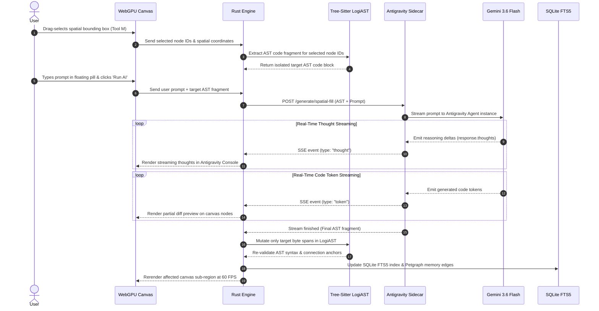
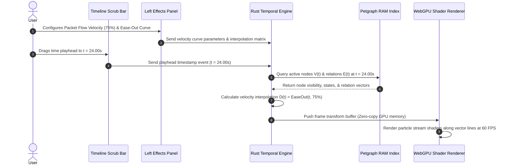
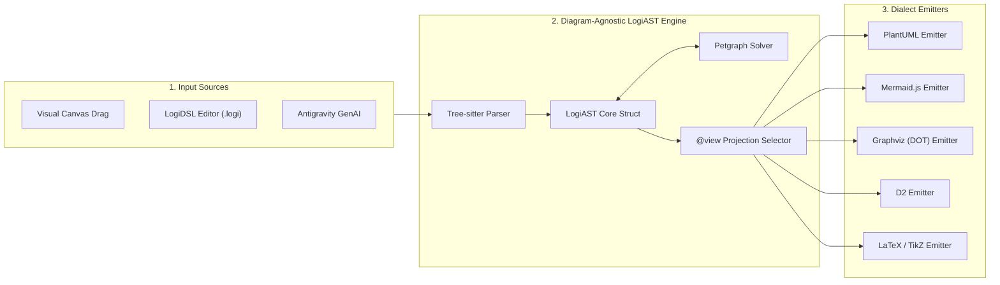
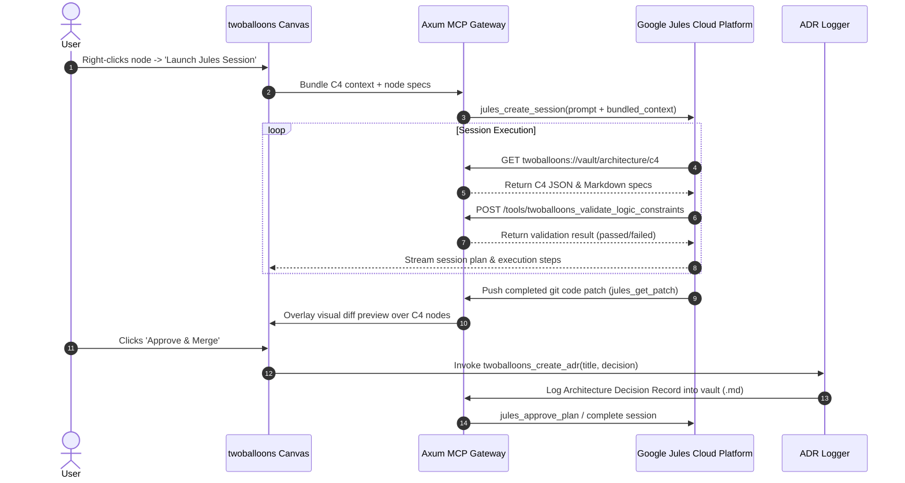
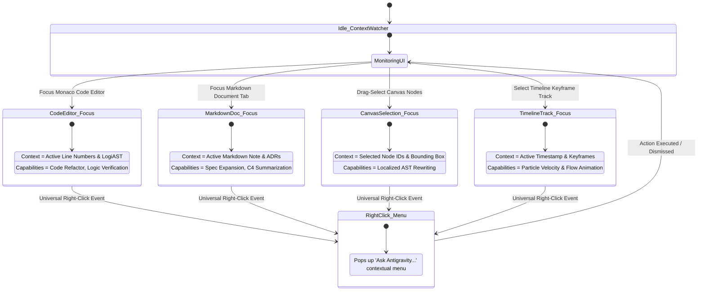

# 🔗 twoballoons Master System Linkage & Integration Specification

> **Comprehensive architectural deep-dive into the linkages, data plumbing, state machines, and event streams across all components in twoballoons.**

---

## 1. Master System Linkage Architecture

The diagram below maps the complete interaction topology connecting the **Adobe-Style Modular UI Layer**, the **Rust Native Engine**, the **Persistence Store**, the **Antigravity AI Engine Sidecar**, and the **Google Jules MCP Gateway**:

```mermaid
graph TD
    subgraph UI_Workspace["1. Adobe-Style Modular UI Layer (Tauri Webview / WebGPU)"]
        UI_Toolbar["Far-Left Vertical Toolstrip (V, M, C, L, T, W, Z)"]
        UI_Canvas["WebGPU Infinite Canvas (PixiJS 60 FPS)"]
        UI_Editor["Monaco LogiDSL Code & Markdown Editor"]
        UI_Timeline["Temporal Timeline Scrub Bar & Effects Panel"]
        UI_Focus["Context-Aware Selection Watcher"]
        UI_Menu["Universal Right-Click 'Ask Antigravity' Menu"]
    end

    subgraph Rust_Core["2. Native Core Compute Engine (Tauri 2.0 / Rust)"]
        IPC["Zero-Copy Tauri IPC Channel"]
        Petgraph["Petgraph In-Memory Graph Index (RAM)"]
        TreeSitter["Tree-Sitter LogiDSL Incremental AST Parser"]
        TemporalEngine["$2D + T$ Keyframe & Velocity Interpolator"]
        MCPServer["Axum Async SSE/Stdio MCP Gateway"]
    end

    subgraph Persistence_Store["3. Persistence & Local Storage"]
        Vault_MD["Markdown Specification Notes (.md)"]
        Vault_Logi["LogiDSL Source Files (.logi)"]
        Vault_Canvas["Visual Layout Files (.canvas)"]
        SQLite["SQLite DB + FTS5 Trigram Full-Text Search"]
    end

    subgraph GenAI_Sidecar["4. Antigravity AI Engine (Python Sidecar)"]
        Daemon["FastAPI IPC Daemon"]
        AgentRuntime["google.antigravity Agent Runtime"]
        ThoughtsStream["Reasoning Streamer ('response.thoughts')"]
        TokenStream["Code Streamer ('response.chat()')"]
    end

    subgraph Agent_Gateway["5. External Agents & Cloud Services"]
        Jules["Google Jules Cloud Platform"]
        IDEs["External IDEs (Cursor, VS Code, Claude Desktop)"]
        Gemini["Gemini 3.6 Pro / Flash APIs"]
    end

    UI_Toolbar -->|Active Tool Events| UI_Canvas
    UI_Canvas <-->|Render Matrix & Node Selection| IPC
    UI_Editor <-->|Text Buffers & Line Anchors| IPC
    UI_Timeline <-->|Playhead Timestamp & Keyframes| IPC
    UI_Focus -->|Active Window Context| Daemon
    UI_Menu -->|Contextual AI Prompts| Daemon

    IPC <--> Petgraph
    IPC <--> TreeSitter
    IPC <--> TemporalEngine
    IPC <--> SQLite

    SQLite <--> Vault_MD
    SQLite <--> Vault_Logi
    SQLite <--> Vault_Canvas

    IPC <-->|Localhost SSE / HTTP| Daemon
    Daemon <--> AgentRuntime
    AgentRuntime <--> ThoughtsStream
    AgentRuntime <--> TokenStream
    AgentRuntime <-->|gRPC / HTTPS| Gemini

    MCPServer <-->|MCP Protocol (JSON-RPC 2.0)| IDEs
    IPC <-->|Jules REST API & Webhooks| Jules
    MCPServer <--> Petgraph
```

---

## 2. Spatial AI "Generative Fill" Data Plumbing Flow

When a user drag-selects a bounding box over canvas nodes and issues a prompt (e.g. *"Convert auth block to Keycloak OAuth2"*), the sequence below demonstrates the precise data flow from visual selection to AST compilation:



---

## 3. Temporal $2\text{D} + T$ Animation & Keyframe Pipeline

The sequence below illustrates how the timeline scrubber interpolates keyframe states and streams particle flow animations across visual nodes:



---

## 4. LogiDSL Multi-Dialect Transpilation Pipeline

`LogiDSL` operates as the intermediate representation (IR) between human inputs and external diagram rendering syntaxes:



---

## 5. Google Jules Autonomous Agent Loop

The lifecycle below shows how **Google Jules** interacts with **twoballoons** via the Model Context Protocol (MCP):



---

## 6. Antigravity Context-Aware Focus State Machine

The state machine below tracks how the **Antigravity AI Engine** adapts its capabilities depending on the user's active focus in the UI:


