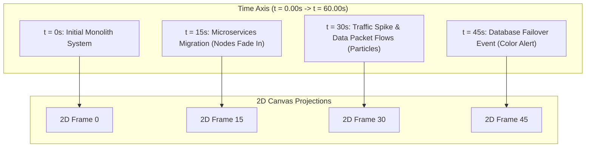
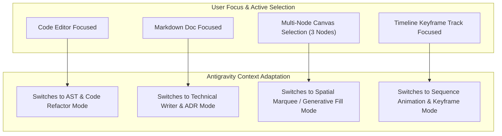

# ⏳ Temporal 3D Graph, Diagram-as-Code & Antigravity Context Specification

> **Deep architecture specification for twoballoons: Temporal Keyframe Scrubbing ($2\text{D} + T$), Interactive Diagram-as-Code Stacks, and Context-Aware Antigravity AI.**

---

## 🕒 1. The 3rd Dimension: Temporal Graph Theory ($2\text{D} + T$)

Traditional diagramming software represents system architecture as a static 2D snapshot. **twoballoons** introduces a temporal third dimension by representing every diagram as a continuous function of time:

$$D(t) = \Big( V(t), \, E(t), \, S(t), \, K(t) \Big)$$

Where at any timestamp $t$:
* $V(t)$ is the set of active, visible, or morphing nodes.
* $E(t)$ is the set of directed relations and animated data packet streams.
* $S(t)$ is the visual styling, highlight glow, or error alert state.
* $K(t)$ is the current keyframe state and interpolation matrix.



---

## 🎛️ 2. Timeline Scrub Bar & Left Keyframe Effects Panel

### A. Timeline Track Architecture
The bottom panel houses a video-editing style multi-track keyframe editor:
* **Time Ruler**: High-precision time scrubbing (`0:00.00` to `1:00.00`).
* **Track Hierarchy**:
  * **Master Track**: Playhead position, global markers, loop points.
  * **Node Tracks**: Keyframe diamonds assigned to individual visual components (e.g. `Node: IngressGateway`).
  * **Relation / Flow Tracks**: Keyframe diamonds controlling packet stream velocity along connection lines.

### B. Left Keyframe Effects Panel
When keyframes are assigned or selected, a dedicated **Timeline Effects Panel** opens on the left of the timeline:

```
┌─────────────────────────────────────────────────────────────┐
│ 🎛️ Timeline Effects Panel                              [✖]  │
├─────────────────────────────────────────────────────────────┤
│ Packet Flow Velocity:                                       │
│ [━━━━━━━●━━━━━━━━━━━━━━] 75%                                 │
│                                                             │
│ Velocity Curve:                                             │
│ ┌─────────────────────────────────────────────────────────┐ │
│ │                  /─-─-─-─● (Ease Out Curve)             │ │
│ │                /                                        │ │
│ │          ●────/                                         │ │
│ └─────────────────────────────────────────────────────────┘ │
│                                                             │
│ Keyframe Interpolation:                                     │
│ [ Ease In v ]  (Options: Linear, Ease Out, Bezier, Step)   │
│                                                             │
│ Effect Presets:                                             │
│ ✦ Data Packet Pulse     ✦ Node Fade In/Out                  │
│ ✦ Particle Stream       ✦ Camera Zoom-to-Node               │
└─────────────────────────────────────────────────────────────┘
```

#### Keyframe Effect Capabilities:
1. **Animated Data Flow**: Dragging the playhead smoothly animates glowing particle streams moving along vector relation lines, demonstrating execution sequences.
2. **Architecture Evolution**: Nodes appear, fade out, or scale morph across time keyframes to illustrate system migrations over months or years.
3. **Runtime Event Simulation**: Simulate traffic spikes, rate limiting, or database failover by animating glow intensities and error colors.

---

## 💻 3. Interactive "Diagram-as-Code" Workspace

**twoballoons** breaks the barrier between visual shapes and raw text code. The diagram code workspace operates as an interactive, multi-layered visual environment:

### Features & Toggle Matrix:
* **Interactive Code Stacks**: Code blocks are organized into collapsible, nested AST stacks (e.g. `stack AuthServices { ... }`) that match C4 container boundaries.
* **Draggable Code Elements**: Drag a code block in the editor to re-order execution logic, or drag a visual node on the canvas to update its position in the `.logi` source code.
* **Toggleable Visual Overlays** (Accessible via top view bar):
  * `[Toggle]` **Inline Syntax Highlighting**: Color-code keywords, entities, and relations.
  * `[Toggle]` **Mini-Map Node Thumbnails**: Renders tiny visual node icons inside code line margins.
  * `[Toggle]` **AST Layer Colors**: Background color tinting matching C4 container levels.
  * `[Toggle]` **Interactive Hover References**: Hovering over a variable highlights its connected canvas nodes.

---

## 🧠 4. Context-Aware Antigravity AI Engine & Universal Right-Click Menu

### A. Context-Aware Focus Tracking
The **Antigravity AI Window** maintains a dynamic context watcher. It observes your active window, panel, or canvas selection and adapts its AI functions automatically:



### B. Universal Right-Click Menu Integration ("Ask Antigravity...")
Every element in the application exposes an **"Ask Antigravity..."** context menu:

* **Right-Click Selected Code Lines**:
  * ✦ *Ask Antigravity: Refactor this block*
  * ✦ *Ask Antigravity: Convert to LogiDSL logic gates*
  * ✦ *Ask Antigravity: Validate logic constraints*
* **Right-Click Canvas Node(s)**:
  * ✦ *Ask Antigravity: Generative Fill sub-region*
  * ✦ *Ask Antigravity: Explain dependencies*
  * ✦ *Ask Antigravity: Create animation keyframe sequence*
  * ✦ *Ask Antigravity: Generate Architecture Decision Record (ADR)*
* **Right-Click Markdown Spec Text**:
  * ✦ *Ask Antigravity: Convert description to C4 diagram*
  * ✦ *Ask Antigravity: Expand technical requirement*
* **Right-Click Timeline Track**:
  * ✦ *Ask Antigravity: Animate DDOS attack flow across these nodes*
  * ✦ *Ask Antigravity: Smooth packet velocity curves*

---

## 🖼️ Visual UI Mockup


